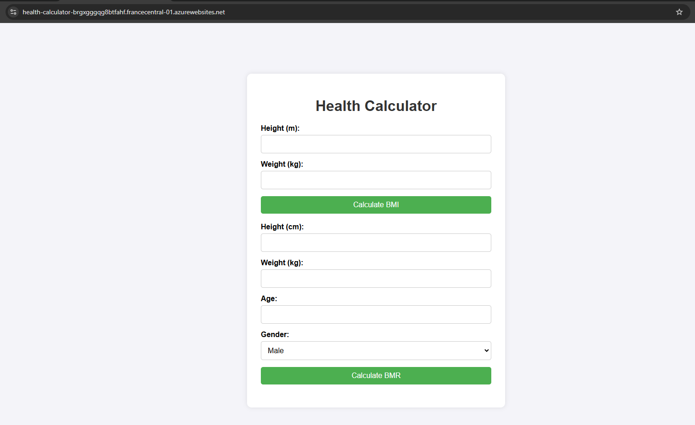
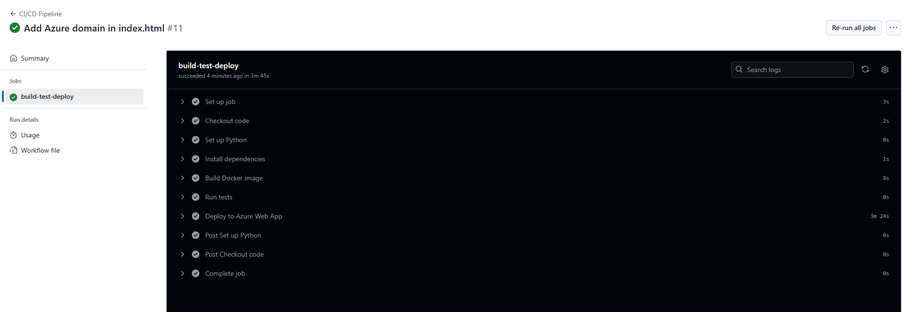

# Examen Python - Camille DETELDER

### Fonctionnalités ajoutées : 
- Ajout d'une interface web basée sur HTML et CSS
- Ajout du flag "--no-cache-dir" dans le Dockerfile pour réduire l'image Docker
- Exécution les tests dans un container Docker

### Résultat :

